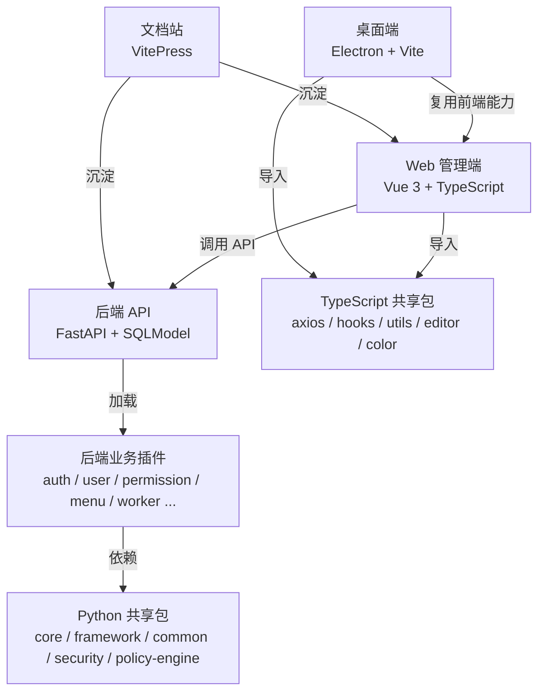

# RapidKit

RapidKit 是一个面向现代管理系统的全栈开发套件，采用 **Vue 3 + FastAPI + 插件化后端 + Monorepo** 架构，覆盖 Web 管理端、后端 API、桌面端、文档站与共享工具包。

项目目标是把后台系统中常见的用户、角色、菜单、权限、任务调度、系统监控、脚本执行、部门组织等能力沉淀为可组合的插件和共享包，让业务功能可以在统一工程体系中快速扩展。

## 核心能力

- **现代管理端**：基于 Vue 3、TypeScript、Naive UI、Pinia、Vue Router、UnoCSS 构建的后台管理界面。
- **插件化后端**：基于 FastAPI 与 Python entry points 的插件发现、依赖排序、路由挂载、生命周期和事件监听机制。
- **权限与治理**：内置用户、角色、菜单、接口权限、按钮权限、字段权限与 ABAC 数据策略能力。
- **异步任务体系**：集成 Celery worker、数据库调度器、任务监控与周期任务插件。
- **桌面端扩展**：提供 Electron 桌面应用壳，复用前端技术栈构建跨端体验。
- **工程化 Monorepo**：使用 pnpm、Turborepo、uv workspace 管理 TypeScript 与 Python 多包协作。
- **文档站体系**：通过 VitePress 维护架构、后端规范、插件标准、错误处理等项目文档。

## 架构概览

RapidKit 同时包含前端应用、后端应用、桌面端、文档站以及跨端共享包：



## 后端分层

后端采用 Python `uv workspace` 与插件化架构，依赖按层级单向流动：

```text
plugins  ──▶  rapidkit-common  ──▶  rapidkit-framework  ──▶  rapidkit-core
                         │
                         └────────▶  rapidkit-security
```

- `rapidkit-core`：配置、数据库、Redis、MinIO、日志、时区、UUID、分布式锁等进程基础设施。
- `rapidkit-framework`：插件运行时、插件加载器、事件总线、异常、状态码、i18n、限流、请求上下文。
- `rapidkit-common`：SQLModel 基类、CRUD 基类、请求/响应 schema、FastAPI 依赖类型与业务通用契约。
- `rapidkit-security`：JWT、密码哈希、RSA 加解密等无状态安全工具。
- `rapidkit-policy-engine`：面向 ABAC 数据策略的规则解析与 SQL 条件生成。
- `apps/backend/plugins/*`：业务域插件，通过 `PluginManifest` 声明路由、模型、依赖、事件监听与生命周期。

## 插件系统

每个后端插件都是独立 Python package，位于 `apps/backend/plugins/<name>/`，并通过 entry point 注册：

```text
plugins/<name>/
├── pyproject.toml
├── src/plugin_<name>/
│   ├── __init__.py       # register() -> PluginManifest
│   ├── <domain>/
│   │   ├── api.py        # FastAPI router
│   │   ├── models.py     # SQLModel ORM
│   │   ├── schemas.py    # Pydantic schema
│   │   ├── crud.py       # BaseCRUD 子类
│   │   ├── services.py   # 业务逻辑
│   │   └── deps.py       # FastAPI 依赖
│   └── status_codes.py
└── migrations/
```

插件可以声明：

- API 路由与数据库模型
- 前置插件依赖
- 启动与关闭生命周期
- 跨插件事件监听器
- FastAPI dependency override
- 数据库迁移目录

当前业务插件包括：`auth`、`user`、`permission`、`department`、`menu`、`monitoring`、`schedule`、`script`、`system`、`worker`。

## 前端应用

`apps/frontend` 是 RapidKit 的 Web 管理端，采用 Vue 3 生态构建：

- Vue 3.5 + TypeScript + Vite
- Naive UI 组件库
- Pinia 状态管理
- Vue Router 文件路由
- Vue I18n 国际化
- UnoCSS 原子化样式
- ECharts 图表能力
- Socket.IO 实时通信
- OpenAPI schema 派生 API 类型

前端 API 类型由后端 OpenAPI schema 生成，并通过 `Service.ApiRequest` / `Service.ApiResponse` 派生业务请求和响应类型，减少前后端接口漂移。

## 项目结构

```text
rapidkit/
├── apps/
│   ├── frontend/          # Vue 3 Web 管理端
│   ├── backend/           # FastAPI 应用壳与业务插件
│   ├── desktop/           # Electron 桌面端
│   └── website/           # VitePress 文档站
├── packages/
│   ├── axios/             # TypeScript HTTP 客户端封装
│   ├── alova/             # TypeScript 请求客户端封装
│   ├── hooks/             # Vue composables
│   ├── utils/             # TypeScript 工具函数
│   ├── color/             # 颜色工具
│   ├── editor/            # 编辑器组件包
│   ├── builder/           # 构建工具包
│   ├── cli/               # RapidKit CLI
│   ├── core/              # Python 基础设施包
│   ├── framework/         # Python 插件运行时
│   ├── common/            # Python 业务通用层
│   ├── security/          # Python 安全工具包
│   └── policy-engine/     # Python 策略引擎
├── docs/                  # 项目辅助文档与资源
├── docker/                # 容器化相关配置
├── package.json           # pnpm workspace 脚本入口
├── pyproject.toml         # uv workspace 定义
├── pnpm-workspace.yaml    # TypeScript workspace 定义
└── turbo.json             # Turborepo 任务配置
```

## 技术栈

| 领域     | 技术                                                                   |
| -------- | ---------------------------------------------------------------------- |
| Web 前端 | Vue 3、TypeScript、Vite、Naive UI、Pinia、Vue Router、Vue I18n、UnoCSS |
| 后端 API | Python 3.14、FastAPI、SQLModel、Pydantic、Alembic、Redis、MinIO        |
| 插件系统 | Python entry points、PluginManifest、拓扑排序、事件总线                |
| 权限治理 | RBAC、按钮权限、接口权限、字段权限、ABAC 数据策略                      |
| 异步任务 | Celery、Celery Beat、数据库调度器、worker 监控                         |
| 桌面端   | Electron、Vite、TypeScript                                             |
| 文档站   | VitePress                                                              |
| 工程化   | pnpm、Turborepo、uv、Ruff、ty、oxlint、oxfmt、Husky、Changesets        |

## 工程质量

RapidKit 使用统一的 workspace 脚本维护代码质量：

- `turbo lint` / `turbo format` / `turbo typecheck` 覆盖 TypeScript 工作区。
- `uv run ruff format`、`uv run ruff check`、`uv run ty check` 覆盖 Python 工作区。
- Husky 在提交与推送前执行约束检查。
- OpenAPI schema 用于生成前端类型，降低接口类型漂移风险。
- Changesets 用于管理多包版本变更。

## 文档

更详细的架构和开发规范沉淀在文档站中，包括：

- Python 包依赖架构
- 后端插件标准
- 服务层规范
- 错误处理与状态码
- 跨插件通信
- 前后端 API 类型约定

RapidKit 的 README 作为项目展示入口，详细开发流程与规范以文档站内容为准。
